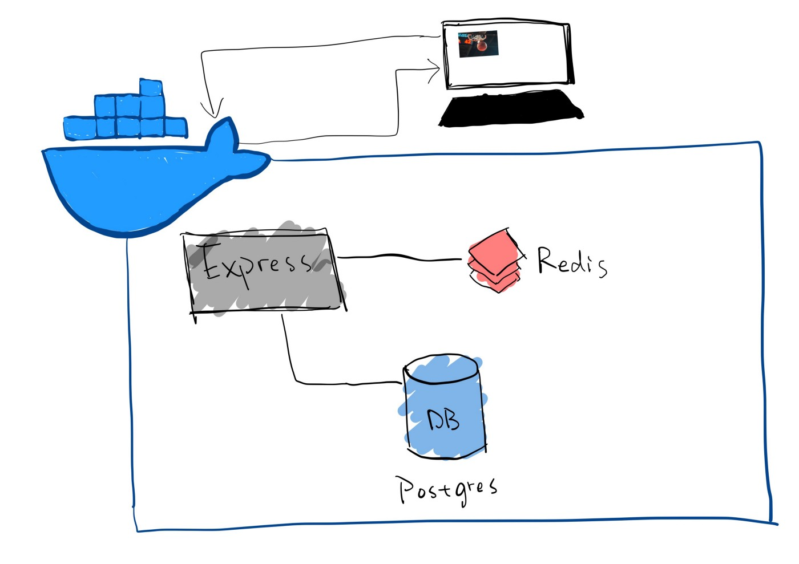

### Dockerized Backend Server — AwesomePhotoApp

*A Docker container with Express server, Postgres db and Redis db to respond a photo based on ID.*

[Medium Blog](https://medium.com/@ray644302280/dockerized-backend-server-awesomephotoapp-a5c716000290)

Tech Stack:

- Docker
- Express.js
- PostgreSQL
- Redis

